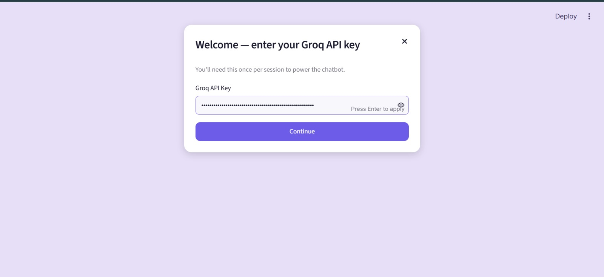
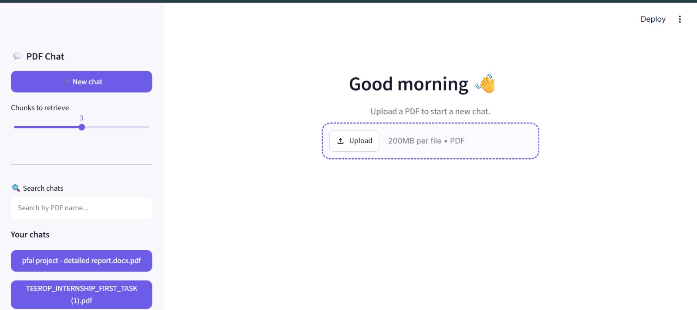
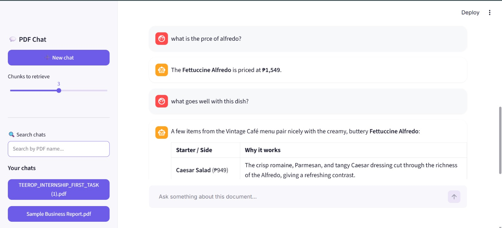
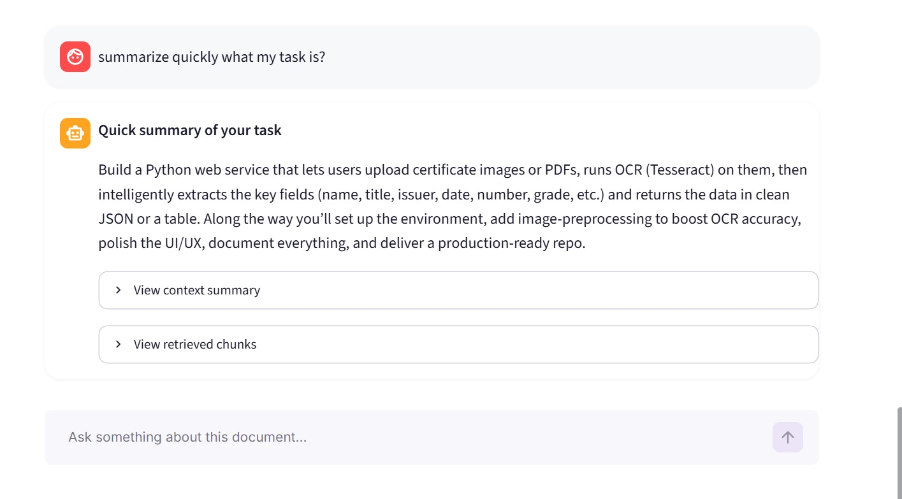
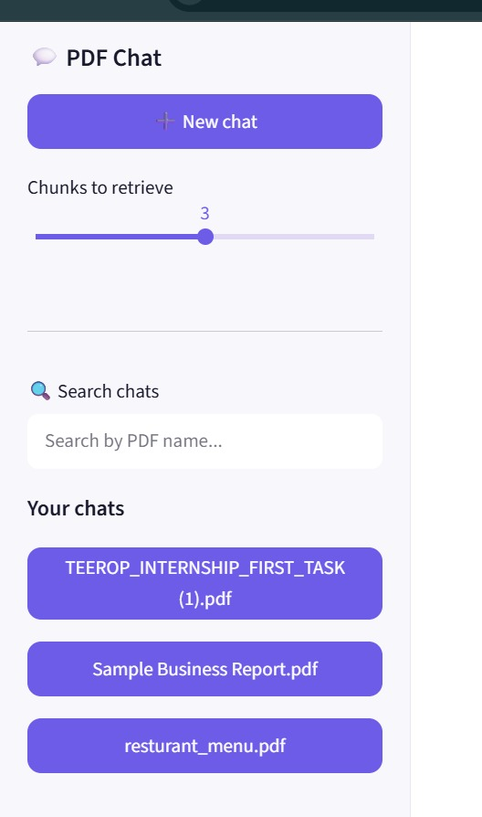
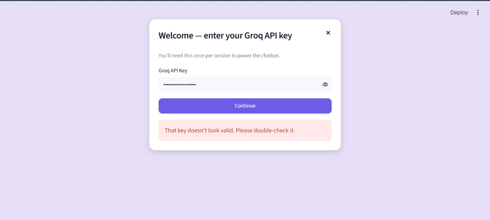

# 📄 PDF ChatBot with RAG & Dual LLM Architecture

An intelligent PDF ChatBot that lets you upload a document and have a real conversation about its content — powered by Retrieval-Augmented Generation (RAG) and a dual LLM pipeline running on Groq's LPU inference.

Built as **Task 2** of the Teerop GenAI & LLM Internship.

---

## 🎥 Demo Video

[Watch the full demo on YouTube]
https://youtu.be/fdDiCp2CxCE

## 🎯 Overview

Instead of pasting an entire PDF into a language model's context window, this app:

1. Extracts and chunks the document's text
2. Converts each chunk into a vector embedding and indexes it with FAISS
3. On every question, retrieves only the most relevant chunks (semantic search)
4. Passes those chunks through **two specialized LLMs** — one to summarize the retrieved context, another to generate the final, conversational answer

The result: fast, accurate, low-hallucination answers grounded in the actual document — with a chat experience that remembers context across turns.

---

## 🏗️ System Architecture

```
Upload PDF → Extract Text (PyMuPDF, with OCR fallback)
           → Chunk Text (LangChain RecursiveCharacterTextSplitter)
           → Generate Embeddings (Sentence Transformers)
           → Store in FAISS Vector Index
                        ↓
User Question → Embed Question → Semantic Search (FAISS)
             → Top-K Relevant Chunks
                        ↓
        LLM 1 — Context Summarizer (openai/gpt-oss-120b)
        Receives: retrieved chunks + recent conversation
        Outputs: focused context summary
                        ↓
        LLM 2 — Answer Generator (openai/gpt-oss-20b)
        Receives: question + summary + chat history
        Outputs: natural, conversational final answer
                        ↓
              Displayed in Chat Interface
      (with expandable context summary & retrieved chunks)
```

Each PDF uploaded starts its own independent **chat session** — its own vector index, its own message history — so you can hold multiple document conversations side by side, switchable from the sidebar.

---

## 🧩 Tech Stack

| Layer | Technology |
|---|---|
| Frontend | Streamlit |
| PDF Text Extraction | PyMuPDF (`fitz`) |
| OCR Fallback | Tesseract OCR via `pytesseract` |
| Text Chunking | LangChain `RecursiveCharacterTextSplitter` |
| Embeddings | Sentence Transformers (`all-MiniLM-L6-v2`) |
| Vector Store | FAISS (`IndexFlatL2`) |
| LLM Inference | Groq API (LPU-based, ultra-fast) |
| Language | Python 3.12 |

---

## 🤖 Groq Model Ecosystem

| Role | Model | Purpose |
|---|---|---|
| LLM 1 — Summarizer | `openai/gpt-oss-120b` | Condenses retrieved chunks into a focused, question-relevant summary |
| LLM 2 — Answer Generator | `openai/gpt-oss-20b` | Generates the final conversational answer using the summary + chat history |

Both models are called through a **single Groq API key**, keeping authentication simple while still splitting the workload across two specialized models — one optimized for quality summarization, one for fast, natural responses.

> **Note on model selection:** This project was originally spec'd around `mixtral-8x7b-32768` and `llama-3.1-8b-instant`. Both were deprecated by Groq during development (Mixtral in March 2025, Llama 3.1 8B Instant in June 2026) in favor of the newer, faster `openai/gpt-oss` model family. The pipeline was updated accordingly — see [Challenges Resolved](#-challenges-resolved) below.

---

## ✨ Features

- **Conversational, multi-turn chat** — not just Q&A, but a real back-and-forth that remembers recent context and knows when to invite follow-up questions
- **Multi-chat sidebar** — every uploaded PDF becomes its own chat, listed and switchable, ChatGPT-style
- **Searchable chat history** — filter past chats by PDF name instead of scrolling
- **API key verification modal** — key is checked against the live Groq API on entry, with a clean error if invalid, before the app unlocks
- **OCR fallback** — if a PDF's text can't be extracted normally (scanned pages, image-heavy design exports, font-encoding issues), the app automatically falls back to Tesseract OCR
- **Adjustable retrieval depth** — control how many chunks (1–5) are retrieved per question
- **Expandable transparency panels** — view the LLM's context summary and the exact retrieved chunks behind every answer
- **Real-time processing indicators** — reading, indexing, searching, and thinking states are all shown as they happen

---

## 🛡️ Error Handling

| Scenario | Handling |
|---|---|
| Invalid or expired Groq API key | Caught at the verification modal *and* at answer-generation time, with a plain-language error |
| Corrupt / unreadable PDF | Caught during extraction, user sees a clear message instead of a crash |
| Empty PDF (0 pages) | Explicit check before processing continues |
| Scanned / image-based / font-encoded PDFs | OCR fallback attempts recovery before failing |
| Groq API rate limits / timeouts | Detected and surfaced as a friendly retry message |
| Empty or whitespace-only questions | Silently ignored, no wasted API call |
| No relevant chunks found for a question | Returns an honest "not found in this document" message instead of hallucinating |
| Windows DLL / dependency conflicts (PyTorch, langchain-community) | Resolved during setup — see below |

---

## 🧪 Testing & Validation

The system was tested against three distinct document types, per the task's validation requirement:

1. **Restaurant menu** (image-heavy, design-exported PDF) — triggered the OCR fallback path; correctly answered pricing and dish-detail questions after OCR recovery
2. **Business report** — accurately summarized financial highlights, identified the main risk, and described company strategy across multiple conversational turns, without inventing figures not present in the source
3. **Technical documentation** — correctly answered architecture, tech-stack, and design-decision questions

Across all three, the system correctly declined to answer out-of-scope questions rather than hallucinating an answer.

---

## 🖼️ Screenshots

| | |
|---|---|
| API Key Verification |  |
| Welcome & Upload |  |
| Conversational Chat |  |
| Context Transparency |  |
| Multi-Chat Sidebar & Search |  |
| Error Handling |  |

## ⚙️ Setup

```bash
# 1. Clone and enter the project
git clone https://github.com/humna-007/pdf-chatbot.git
cd pdf-chatbot

# 2. Create and activate a virtual environment
python -m venv venv
venv\Scripts\Activate.ps1        # Windows PowerShell

# 3. Install dependencies
pip install -r requirements.txt

# 4. Run the app
streamlit run app.py
```

You'll be prompted for a Groq API key on first launch (get one free at [console.groq.com](https://console.groq.com)).

---

## 🧗 Challenges Resolved

- **Groq model deprecation mid-project** — both originally specified models (`mixtral-8x7b-32768`, `llama-3.1-8b-instant`) were retired by Groq during development; migrated the pipeline to `openai/gpt-oss-120b` and `openai/gpt-oss-20b` with no architectural changes needed
- **PyTorch DLL load failure on Windows** — resolved by installing the Microsoft Visual C++ Redistributable
- **Dependency resolution timeouts** — slow network conditions caused `pip` to backtrack through hundreds of `langchain` versions; resolved by pinning exact compatible versions
- **Font-encoding PDFs returning empty text** — some design-exported PDFs (e.g. Canva menus) pass PyMuPDF's normal extraction with no error but return empty text due to missing Unicode character maps; solved with an automatic Tesseract OCR fallback
- **Duplicate Streamlit widget IDs** — resolved by consolidating file-uploader instances

---

## 🚀 Future Enhancements

- Multi-document support within a single chat for comparative analysis
- Persistent chat history across sessions (currently session-only)
- Model selection interface for users to choose between speed/quality trade-offs
- Export functionality for chat transcripts
- Page-level citation references alongside retrieved chunks
- Vision-model support for image-heavy document content beyond OCR text

---

## 📌 Project Info

**Internship:** Teerop — GenAI & LLM Internship
**Task:** Task 2 — Intelligent Document Assistant
**Author:** Humna